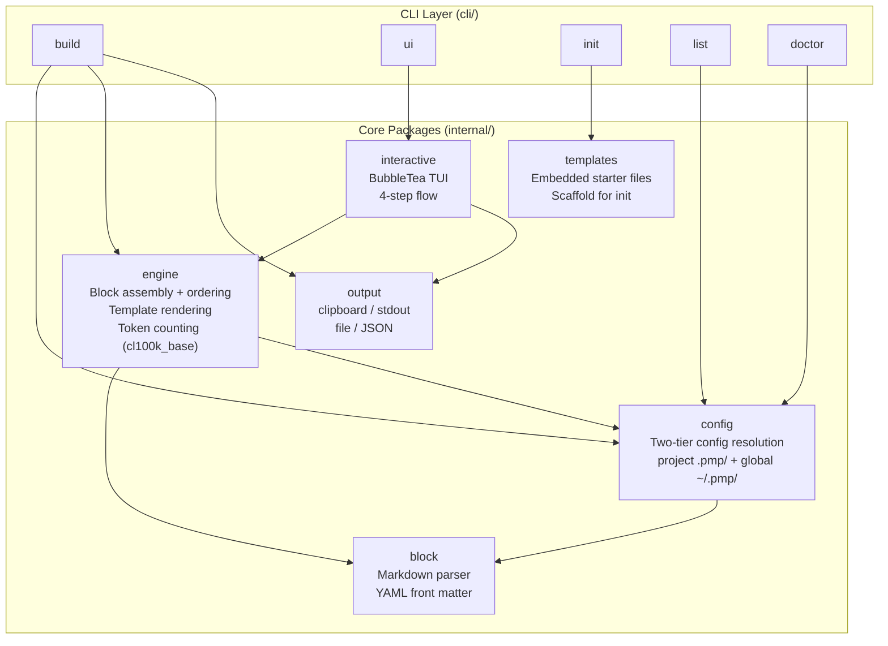
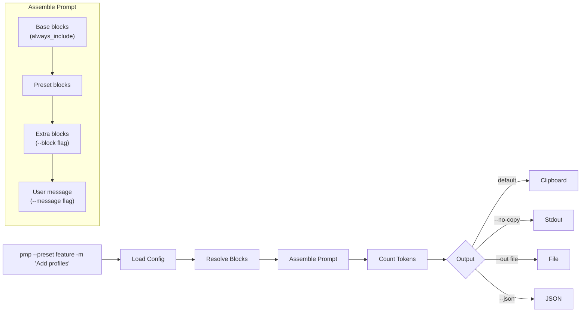

# pmp

`pmp` is a CLI-first prompt builder for assembling reusable LLM prompts from Markdown blocks.

It supports:
- fast prompt assembly through `pmp --preset ...`
- project-local overrides through `./.pmp/`
- interactive composition through `pmp ui`
- output to clipboard, stdout, file, or JSON

## Architecture



## How It Works



The prompt is assembled by concatenating blocks in order: **base** -> **preset** -> **extra** -> **message**.  
Message position is configurable via `message_position` (`top` or `bottom`, default: `bottom`).

## Install

### Go install (recommended)

```bash
go install github.com/singl3focus/pmp/cmd/pmp@latest
```

This installs the latest release into your `$GOPATH/bin`.

### Download from GitHub Releases

Pre-built binaries are available for **Linux**, **macOS**, and **Windows** (amd64 + arm64):

1. Go to [Releases](https://github.com/singl3focus/pmp/releases)
2. Download the archive for your platform
3. Extract and move `pmp` (or `pmp.exe`) to a directory in your `PATH`

### Build from source

```bash
git clone https://github.com/singl3focus/pmp.git
cd pmp
make build VERSION=0.1.0
```

Or without Make:

```bash
go build ./cmd/pmp
```

On Windows this produces `pmp.exe`.

## Quick Start

Initialize a project-local setup:

```bash
pmp init
```

Build a prompt from a preset:

```bash
pmp --preset feature -m "Add user profiles to product cards"
```

Build to a file:

```bash
pmp --preset review -m "Review auth flow" --out prompt.md
```

Preview the resolved plan without emitting output:

```bash
pmp --preset feature -m "Add CSV export" --dry-run
```

Launch the interactive builder:

```bash
pmp ui
```

## Command Model

Primary path:

```bash
pmp --preset <name> -m "<task>"
```

Short alias:

```bash
pmp -p <name> -m "<task>"
```

Explicit form is also supported:

```bash
pmp build --preset <name> -m "<task>"
```

Other commands:

```text
pmp init
pmp init --global
pmp list
pmp doctor
pmp version
pmp ui
```

`pmp version` prints:

```text
version: 0.1.0
commit: abc1234
date: 2026-04-02T12:00:00Z
```

## Config Resolution

`pmp` supports two configuration roots:

1. `./.pmp/`
2. `~/.pmp/`

Resolution order:
- project-local config overrides global config
- project-local blocks override global blocks by relative path

## Directory Layout

Example project-local layout:

```text
./.pmp/
  config.yaml
  base/
    global.md
  blocks/
    intro/
    communication/
    tools/
    tasks/
```

## Config Example

```yaml
version: 1
separator: "\n\n"
copy_by_default: true
token_warning_threshold: 24000
message_position: bottom       # "top" or "bottom" (default: "bottom")

base:
  always_include:
    - global.md

presets:
  feature:
    description: "New feature implementation"
    blocks:
      - intro/senior-dev.md
      - communication/concise.md
      - tools/dev-tools.md
      - tasks/feature.md
```

### Config fields

| Field | Type | Default | Description |
|-------|------|---------|-------------|
| `version` | int | `1` | Config schema version |
| `separator` | string | `"\n\n"` | Separator between prompt parts |
| `copy_by_default` | bool | `true` | Copy result to clipboard automatically |
| `token_warning_threshold` | int | `24000` | Warn when token count exceeds this |
| `message_position` | string | `"bottom"` | Where to place the user message: `"top"` or `"bottom"` |

## Block Format

Blocks are Markdown files with optional YAML front matter:

```markdown
---
title: Senior Developer
description: Senior engineering persona
tags: [engineering, coding]
weight: 10
---
You are a senior software engineer. Favor clear reasoning, practical tradeoffs, and production-grade output.
```

## TUI Controls

Current `pmp ui` flow:
- choose a preset
- filter and toggle extra blocks
- enter the task message
- choose output target

Useful keys:
- `up` / `down`: move
- `enter`: continue or confirm
- `space`: toggle extra block
- `/`: start block filter
- `ctrl+s`: save current configuration as a preset
- `pgup` / `pgdown`: scroll preview
- `esc`: go back
- `ctrl+c`: quit

## Verification

Run:

```bash
go test ./...
go build ./cmd/pmp
```

Or with the local release helpers:

```bash
make fmt
make test
make build VERSION=dev
```

## Release

Local snapshot build with GoReleaser:

```bash
make snapshot
```

GitHub release flow:
- push a tag like `v0.1.0`
- GitHub Actions runs `.github/workflows/release.yml`
- GoReleaser builds archives and publishes the GitHub release

CI flow:
- `.github/workflows/ci.yml` runs on pushes and pull requests
- validates `go mod tidy`, `go test ./...`, and `go build ./cmd/pmp`

## Known Gaps

- the TUI is functional but still intentionally lightweight
- preview scrolling is basic offset-based scrolling, not a rich viewport yet
- there is no separate editor integration yet
