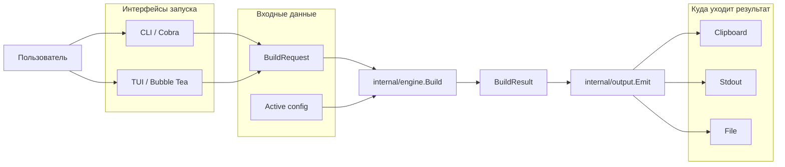
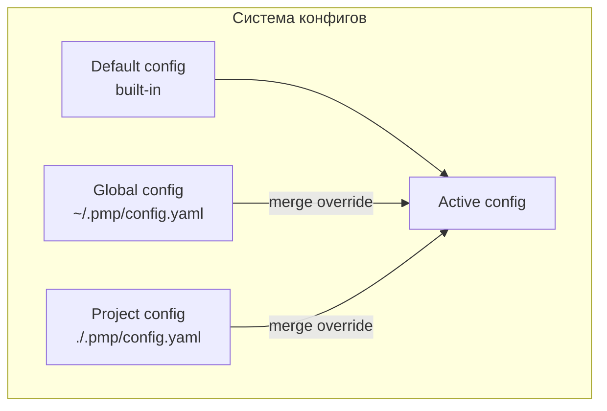
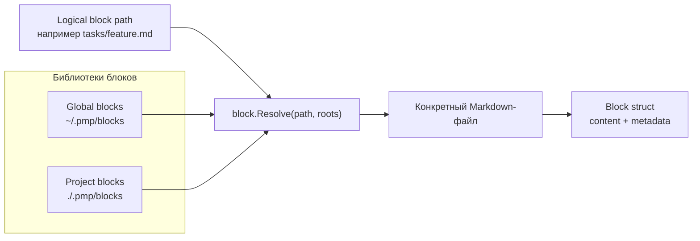
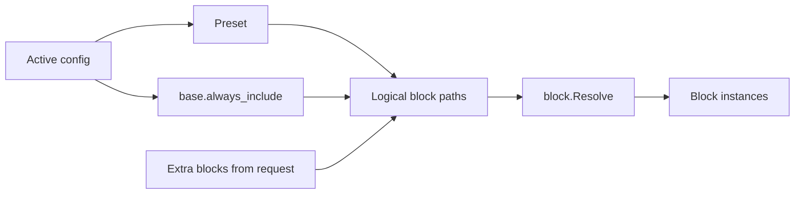
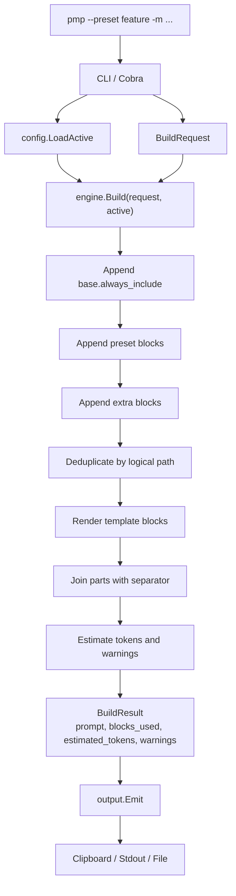
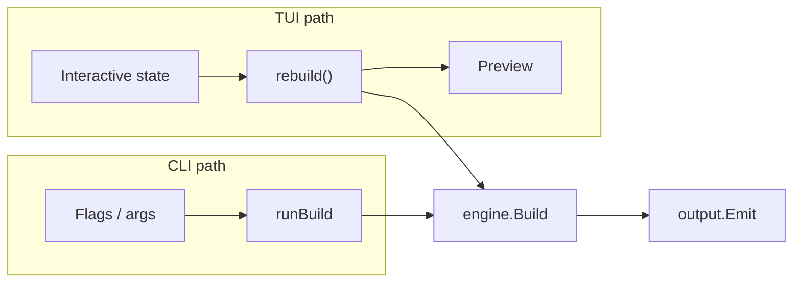

# Техническое описание проекта `pmp`

## 1. Что это за проект

`pmp` это CLI-инструмент на Go для сборки LLM prompt'ов из переиспользуемых Markdown-блоков.

Идея проекта простая:

- prompt не хранится как один большой текст
- он собирается из базовых инструкций, стилевых блоков, task-блоков и пользовательского сообщения
- итоговую композицию можно собрать из CLI или через TUI

Проект уже находится в рабочем состоянии раннего MVP: есть сборка prompt'а, project/global config, TUI, doctor, init, list, JSON/file/stdout/clipboard output.

## 2. Как устроен entrypoint

Точка входа максимально тонкая. Она почти не содержит логики, а только настраивает консоль и передает выполнение в CLI-слой.

```go
package main

import (
    "fmt"
    "os"

    "github.com/singl3focus/pmp/cli"
)

var (
    version = "dev"
    commit  = "none"
    date    = "unknown"
)

func main() {
    initConsole()

    if err := cli.Execute(os.Args[1:], cli.VersionInfo{
        Version: version,
        Commit:  commit,
        Date:    date,
    }); err != nil {
        fmt.Fprintln(os.Stderr, err)
        os.Exit(1)
    }
}
```

Это хорошее решение, потому что:

- `cmd/pmp` не знает ничего о бизнес-логике
- версионирование и build metadata легко прокидываются через linker flags
- основная логика сосредоточена в тестируемых пакетах

На Windows есть отдельная инициализация кодовой страницы консоли:

```go
func initConsole() {
    const utf8CodePage = 65001

    kernel32 := syscall.NewLazyDLL("kernel32.dll")
    setConsoleOutputCP := kernel32.NewProc("SetConsoleOutputCP")
    setConsoleCP := kernel32.NewProc("SetConsoleCP")

    _, _, _ = setConsoleOutputCP.Call(uintptr(utf8CodePage))
    _, _, _ = setConsoleCP.Call(uintptr(utf8CodePage))
}
```

Это важно, потому что проект активно работает с русским текстом и Markdown, а без этого Windows-консоль часто ломает UTF-8 вывод.

## 3. CLI-маршрутизация

Сейчас CLI построен на `spf13/cobra`, но с сохранением удобного root build flow.

```go
func Execute(args []string, build VersionInfo) error {
    root := newRootCommand(build)
    root.SetArgs(normalizeArgs(args))
    root.SetOut(os.Stdout)
    root.SetErr(os.Stderr)
    return root.Execute()
}
```

Root-команда создается один раз и получает набор подкоманд:

```go
cmd.AddCommand(
    newBuildCommand(),
    newInitCommand(),
    newListCommand(),
    newDoctorCommand(),
    newVersionCommand(build),
    newUICommand(),
)
```

При этом у root-команды есть собственный `RunE`, который умеет работать как shortcut для `build`:

```go
RunE: func(cmd *cobra.Command, args []string) error {
    if opts.version {
        return printVersion(build)
    }
    if len(args) == 0 && !opts.build.hasAnyFlags() {
        return cmd.Help()
    }
    return runBuild(opts.build)
}
```

Дополнительно есть нормализация аргументов:

```go
func normalizeArgs(args []string) []string {
    if len(args) == 0 {
        return nil
    }
    if shouldUseImplicitBuild(args[0]) {
        return append([]string{"build"}, args...)
    }
    return args
}
```

Ключевое поведение теперь такое:

- если пользователь вызывает явную подкоманду, например `pmp init` или `pmp doctor`, маршрутизацию делает Cobra
- если первый аргумент не выглядит как известная команда и не начинается с `-`, CLI автоматически подставляет `build`
- если пользователь передает build-флаги прямо в root, например `pmp --preset feature -m "..."`, root-команда сама вызывает `runBuild`
- `--version` поддерживается и как root-флаг, и как отдельная команда `pmp version`

То есть UX остался прежним: `pmp build ...` это явная форма, а `pmp --preset feature -m "..."` остается короткой root-формой поверх Cobra без необходимости каждый раз писать `build`.

## 4. Архитектурные схемы использования

Перед разбором пакетов полезно увидеть систему как несколько простых потоков: от пользовательского ввода к `engine.Build`, от конфигов к итоговому recipe и от block library к финальному prompt.

### 4.1 Главные сущности

В проекте есть несколько прикладных сущностей, которые важно не смешивать:

- `block` это Markdown-файл с телом инструкции и optional front matter metadata
- `preset` это именованный recipe в config, который перечисляет logical paths блоков
- `config` это правила сборки: separator, always_include, presets, copy behavior, token threshold
- `engine` это слой, который из `BuildRequest` и активного конфига собирает итоговый prompt
- `output` это слой, который решает, куда отдать результат: clipboard, stdout или файл
- `cli` и `tui` это только интерфейсы запуска одного и того же build-потока



Смысл схемы: и CLI, и TUI только готовят входные данные для одного и того же `engine.Build`, а публикацией результата занимается отдельный output-слой.

### 4.2 Схема конфигов и блоков

Конфиги и блоки живут в двух независимых, но связанных системах.

Первая система это конфиги:



Именно `Active config` определяет:

- какие блоки всегда включать через `base.always_include`
- какие preset'ы доступны
- какой separator использовать между частями prompt'а
- нужно ли копировать результат в clipboard по умолчанию

Вторая система это библиотеки блоков:



Здесь preset не хранит сам текст prompt'а. Он хранит только logical paths блоков. Затем `engine` резолвит каждый путь в реальный файл, читает его, при необходимости рендерит шаблон и кладет в итоговую композицию.

Если смотреть на обе системы вместе, то связь такая:



### 4.3 Схема сборки prompt'а

Основной пользовательский сценарий можно показать так:



Важная мысль здесь такая:

- конфиг определяет recipe и правила сборки
- block library поставляет содержимое
- engine ничего не знает о CLI UX, а только собирает prompt
- output ничего не знает о preset'ах, а только публикует готовый результат

То есть архитектура разрезана по потоку данных, а не по формальным слоям ради слоев.

### 4.4 Где находится TUI

TUI не является отдельным способом сборки prompt'а. Он является альтернативным способом подготовить тот же `BuildRequest`.



Это важное архитектурное решение:

- prompt composition существует в одном месте, в `internal/engine`
- CLI и TUI не должны синхронно дублировать бизнес-логику
- preview в TUI показывает почти тот же результат, который потом получит обычный CLI build

Именно поэтому дальше имеет смысл рассматривать проект не как набор экранов и команд, а как один build engine, вокруг которого построены несколько интерфейсов и несколько источников данных.

## 5. Структура проекта по слоям

Репозиторий разделен на понятные зоны ответственности:

- `cmd/pmp` содержит только входную точку и platform-specific console setup
- `cli` содержит парсинг аргументов и orchestration по командам
- `internal/config` отвечает за конфиги и приоритеты project/global
- `internal/block` отвечает за блоки, front matter и merge библиотек
- `internal/engine` отвечает за сборку prompt'а
- `internal/output` отвечает за stdout/file/clipboard/json
- `internal/interactive` отвечает за Bubble Tea TUI
- `internal/templates` отвечает за встроенные starter assets для `init`

Это хороший размер модулей: ответственность разрезана по функциям, а не по абстрактным слоям ради слоев.

## 6. Основной сценарий сборки prompt'а

Пользовательский сценарий выглядит так:

```bash
pmp --preset feature -m "Добавить профили"
```

Разберем фактический поток данных.

### 6.1 Парсинг флагов

`runBuild` собирает входные параметры:

```go
type buildFlags struct {
    preset     string
    message    string
    blocks     csvFlag
    vars       kvFlag
    tokenLimit int
    dryRun     bool
    noCopy     bool
    out        string
    json       bool
}
```

Инициализация флагов:

```go
fs.StringVar(&flags.preset, "preset", "", "preset name")
fs.StringVar(&flags.preset, "p", "", "preset name")
fs.StringVar(&flags.message, "message", "", "task message")
fs.StringVar(&flags.message, "m", "", "task message")
fs.Var(&flags.blocks, "block", "comma separated extra block paths")
fs.Var(&flags.vars, "var", "template variable key=value")
fs.IntVar(&flags.tokenLimit, "token-limit", 0, "warn when estimated tokens exceed this limit")
fs.BoolVar(&flags.dryRun, "dry-run", false, "show resolved build plan without output")
fs.BoolVar(&flags.noCopy, "no-copy", false, "print prompt to stdout instead of copying")
fs.StringVar(&flags.out, "out", "", "write prompt or json result to file")
fs.BoolVar(&flags.json, "json", false, "emit json result")
```

Если `preset` не указан, сборка останавливается ошибкой:

```go
if flags.preset == "" {
    return fmt.Errorf("missing required flag --preset")
}
```

### 6.2 Загрузка активной конфигурации

После парсинга вызывается:

```go
active, err := config.LoadActive(".")
```

Это один из главных узлов проекта.

### 6.3 Сборка через engine

Дальше CLI передает все в engine:

```go
result, err := engine.Build(engine.BuildRequest{
    PresetName:  flags.preset,
    Message:     flags.message,
    ExtraBlocks: flags.blocks.Values(),
    Vars:        flags.vars.Values(),
    TokenLimit:  flags.tokenLimit,
    DryRun:      flags.dryRun,
}, active)
```

### 6.4 Вывод результата

После `Build` результат либо печатается как dry-run, либо уходит в output layer:

```go
mode, err := output.Emit(result, output.Options{
    NoCopy:  noCopy,
    OutFile: flags.out,
    JSON:    flags.json,
})
```

То есть `cli/build.go` не собирает prompt сам. Он выступает как orchestration layer между конфигом, engine и output.

## 7. Модель конфигурации

Конфиг имеет следующую прикладную структуру:

```go
type Config struct {
    Version               int
    Separator             string
    CopyByDefault         bool
    TokenWarningThreshold int
    Base                  BaseConfig
    Presets               map[string]Preset
}

type BaseConfig struct {
    AlwaysInclude []string `yaml:"always_include"`
}

type Preset struct {
    Description string            `yaml:"description"`
    Blocks      []string          `yaml:"blocks"`
    DefaultVars map[string]string `yaml:"default_vars"`
}
```

Базовый встроенный конфиг выглядит так:

```yaml
version: 1
separator: "\n\n"
copy_by_default: true
token_warning_threshold: 24000

base:
  always_include:
    - global.md

presets:
  feature:
    description: "New feature implementation"
    blocks:
      - intro/senior-dev.md
      - communication/concise.md
      - tools/dev-tools.md
      - tasks/feature.md

  review:
    description: "Code review"
    blocks:
      - intro/senior-dev.md
      - communication/detailed.md
      - tasks/review.md

  bugfix:
    description: "Bug fixing"
    blocks:
      - intro/senior-dev.md
      - communication/concise.md
      - tasks/bugfix.md
```

Это показывает продуктовую идею: preset это по сути именованный recipe из block paths.

## 8. Как ищется project и global config

Логика поиска устроена через `LoadActive`.

Ключевой фрагмент:

```go
func LoadActive(cwd string) (Active, error) {
    projectRoot, globalRoot, err := discoverRoots(cwd)
    if err != nil {
        return Active{}, err
    }

    projectPath := ""
    globalPath := ""
    if projectRoot != "" {
        projectPath = filepath.Join(projectRoot, "config.yaml")
    }
    if globalRoot != "" {
        globalPath = filepath.Join(globalRoot, "config.yaml")
    }
    if projectPath == "" && globalPath == "" {
        return Active{}, ErrConfigNotFound
    }

    cfg := Default()
    activePath := globalPath
    if globalPath != "" {
        globalCfg, err := loadFile(globalPath)
        if err != nil {
            return Active{}, err
        }
        cfg = merge(cfg, globalCfg)
    }
    if projectPath != "" {
        projectCfg, err := loadFile(projectPath)
        if err != nil {
            return Active{}, err
        }
        cfg = merge(cfg, projectCfg)
        activePath = projectPath
    }

    return Active{
        ProjectRoot:      projectRoot,
        GlobalRoot:       globalRoot,
        ActiveConfigPath: activePath,
        Config:           cfg,
    }, nil
}
```

Смысл такой:

- сначала ищется project config
- потом global config
- дальше поверх дефолтов применяется global
- затем поверх него project

Это дает понятный override order.

### 8.1 Важный защитный механизм

Поиск project config прекращается на границе `.git`:

```go
func discoverProjectRoot(start string) (string, error) {
    dir := start
    for {
        projectRoot := filepath.Join(dir, ".pmp")
        if _, err := os.Stat(filepath.Join(projectRoot, "config.yaml")); err == nil {
            return projectRoot, nil
        } else if !os.IsNotExist(err) {
            return "", err
        }

        if _, err := os.Stat(filepath.Join(dir, ".git")); err == nil {
            return "", nil
        } else if !os.IsNotExist(err) {
            return "", err
        }

        parent := filepath.Dir(dir)
        if parent == dir {
            return "", nil
        }
        dir = parent
    }
}
```

Идея хорошая: не подтягивать `.pmp` из случайного родительского каталога вне репозитория.

### 8.2 Merge-логика

Слияние сделано намеренно неглубоким:

```go
func merge(base Config, override fileConfig) Config {
    result := base
    if override.Version != 0 {
        result.Version = override.Version
    }
    if override.Separator != "" {
        result.Separator = override.Separator
    }
    if override.CopyByDefault != nil {
        result.CopyByDefault = *override.CopyByDefault
    }
    if override.TokenWarningThreshold != 0 {
        result.TokenWarningThreshold = override.TokenWarningThreshold
    }
    if override.Base != nil && override.Base.AlwaysInclude != nil {
        result.Base.AlwaysInclude = append([]string(nil), (*override.Base.AlwaysInclude)...)
    }
    if len(override.Presets) > 0 {
        for name, preset := range override.Presets {
            result.Presets[name] = preset
        }
    }
    return result
}
```

Следствия этого решения:

- scalar-поля переопределяются
- `always_include` заменяется целиком
- preset с тем же именем заменяется целиком
- deep merge внутри preset не делается

Это упрощает поведение, но местами ограничивает гибкость.

## 9. Модель блоков

Каждый Markdown-файл превращается в структуру:

```go
type Block struct {
    Path        string
    Name        string
    Category    string
    Title       string
    Description string
    Tags        []string
    Weight      int
    Hidden      bool
    Template    *bool
    Content     string
    Source      string
}
```

Парсинг front matter выглядит так:

```go
type frontMatter struct {
    Title       string   `yaml:"title"`
    Description string   `yaml:"description"`
    Tags        []string `yaml:"tags"`
    Weight      int      `yaml:"weight"`
    Hidden      bool     `yaml:"hidden"`
    Template    *bool    `yaml:"template"`
}
```

Пример блока из встроенных assets:

```markdown
---
title: Senior Developer
description: Senior engineering persona
tags: [engineering, coding]
weight: 10
---
You are a senior software engineer. Favor clear reasoning, practical tradeoffs, and production-grade output.
```

### 9.1 Как определяется, рендерить шаблон или нет

Это сделано не слепо:

```go
func (b Block) NeedsRender() bool {
    if b.Template != nil {
        return *b.Template
    }
    return strings.Contains(b.Content, "{{ .")
}
```

Это аккуратное решение. Оно избегает случайного `text/template` parsing для контента, в котором literal-строки вроде `{{ range $i }}` приведены просто как пример.

### 9.2 Безопасность путей

Нормализация относительных путей:

```go
func normalizeRelativePath(relPath string) (string, error) {
    clean := filepath.Clean(filepath.FromSlash(strings.TrimSpace(relPath)))
    switch {
    case clean == "", clean == ".":
        return "", fmt.Errorf("block path is required")
    case filepath.IsAbs(clean):
        return "", fmt.Errorf("block %q must be relative to the block root", relPath)
    case clean == "..":
        return "", fmt.Errorf("block %q escapes the block root", relPath)
    case strings.HasPrefix(clean, ".."+string(filepath.Separator)):
        return "", fmt.Errorf("block %q escapes the block root", relPath)
    default:
        return filepath.ToSlash(clean), nil
    }
}
```

И повторная проверка внутри root:

```go
func resolveWithinRoot(rootDir, relPath string) (string, error) {
    rootDir = filepath.Clean(rootDir)
    absPath := filepath.Clean(filepath.Join(rootDir, filepath.FromSlash(relPath)))
    relToRoot, err := filepath.Rel(rootDir, absPath)
    if err != nil {
        return "", err
    }
    if relToRoot == ".." || strings.HasPrefix(relToRoot, ".."+string(filepath.Separator)) {
        return "", fmt.Errorf("block %q escapes the block root", relPath)
    }
    return absPath, nil
}
```

Это правильная защита от path traversal.

## 10. Merge библиотек блоков

Загрузка merged block library выглядит так:

```go
func LoadMerged(roots []Root) (map[string]Block, error) {
    merged := map[string]Block{}
    for _, root := range roots {
        if root.Dir == "" {
            continue
        }

        err := filepath.WalkDir(root.Dir, func(path string, entry fs.DirEntry, walkErr error) error {
            if walkErr != nil {
                return walkErr
            }
            if entry.IsDir() || filepath.Ext(path) != ".md" {
                return nil
            }

            relPath, err := filepath.Rel(root.Dir, path)
            if err != nil {
                return err
            }

            item, err := LoadFile(path, filepath.ToSlash(relPath), root.Source)
            if err != nil {
                return err
            }
            merged[item.Path] = item
            return nil
        })
        if err != nil {
            return nil, err
        }
    }
    return merged, nil
}
```

Ключевой момент: map заполняется последовательно по roots, и более поздний root перекрывает более ранний по `item.Path`.

А roots формируются так:

```go
func (a Active) BlockRoots() []block.Root {
    var roots []block.Root
    if a.GlobalRoot != "" {
        roots = append(roots, block.Root{Dir: filepath.Join(a.GlobalRoot, "blocks"), Source: "global"})
    }
    if a.ProjectRoot != "" {
        roots = append(roots, block.Root{Dir: filepath.Join(a.ProjectRoot, "blocks"), Source: "project"})
    }
    return roots
}
```

То есть project blocks реально перекрывают global blocks.

## 11. Engine как главный бизнес-слой

Главная модель запроса:

```go
type BuildRequest struct {
    PresetName  string
    Message     string
    ExtraBlocks []string
    Vars        map[string]string
    TokenLimit  int
    DryRun      bool
}
```

Главная модель результата:

```go
type BuildResult struct {
    PresetName      string   `json:"preset_name"`
    Message         string   `json:"message,omitempty"`
    Prompt          string   `json:"prompt"`
    BlocksUsed      []string `json:"blocks_used"`
    EstimatedTokens int      `json:"estimated_tokens"`
    Warnings        []string `json:"warnings,omitempty"`
}
```

### 11.1 Фактический алгоритм Build

Ключевой кусок:

```go
for _, path := range active.Config.Base.AlwaysInclude {
    if err := appendBlock(path, active.BaseRoots()); err != nil {
        return BuildResult{}, err
    }
}
for _, path := range preset.Blocks {
    if err := appendBlock(path, active.BlockRoots()); err != nil {
        return BuildResult{}, err
    }
}
for _, path := range req.ExtraBlocks {
    if err := appendBlock(path, active.BlockRoots()); err != nil {
        return BuildResult{}, err
    }
}
```

Затем:

```go
var parts []string
if msg := strings.TrimSpace(req.Message); msg != "" {
    parts = append(parts, msg)
}

for _, item := range ordered {
    text := item.Content
    if item.NeedsRender() {
        var err error
        text, err = render(text, data, item.Path)
        if err != nil {
            return BuildResult{}, err
        }
    }
    if text = strings.TrimSpace(text); text != "" {
        parts = append(parts, text)
    }
}

prompt := strings.Join(parts, active.Config.Separator)
```

Это означает:

- сначала идет `message`
- потом base blocks
- потом preset blocks
- потом extra blocks
- повторяющиеся пути удаляются через `seen`

То есть message является заголовком всей сборки. Это подтверждается и тестом.

### 11.2 Дедупликация блоков

Важная часть:

```go
seen := map[string]struct{}{}

appendBlock := func(path string, roots []block.Root) error {
    item, err := block.Resolve(path, roots)
    if err != nil {
        return err
    }
    if _, ok := seen[item.Path]; ok {
        return nil
    }
    seen[item.Path] = struct{}{}
    ordered = append(ordered, item)
    used = append(used, item.Path)
    return nil
}
```

То есть дубли отсекаются по logical path, а не по содержимому.

### 11.3 Шаблонный рендеринг

Доступные данные шаблона:

```go
type renderInput struct {
    Vars   map[string]string
    Date   string
    Preset string
}
```

Рендеринг:

```go
func render(content string, data renderInput, name string) (string, error) {
    tpl, err := template.New(filepath.ToSlash(name)).Option("missingkey=error").Parse(content)
    if err != nil {
        return "", fmt.Errorf("parse template %s: %w", name, err)
    }

    var buf bytes.Buffer
    if err := tpl.Execute(&buf, data); err != nil {
        return "", fmt.Errorf("render template %s: %w", name, err)
    }
    return buf.String(), nil
}
```

Решение `missingkey=error` очень правильное: проект предпочитает явную ошибку молчаливому повреждению prompt'а.

### 11.4 Оценка токенов

Сейчас оценка такая:

```go
func estimateTokens(text string) int {
    fields := strings.Fields(text)
    if len(fields) == 0 {
        return 0
    }
    charCount := len([]rune(text))
    estimate := charCount / 4
    if estimate < len(fields) {
        return len(fields)
    }
    return estimate
}
```

Это intentionally rough heuristic, а не настоящий tokenizer под конкретную модель.

Следствие:

- как ранний warning system это нормально
- как точный budget control для реальных моделей пока недостаточно

## 12. Output layer

Output layer выбирает один из трех режимов:

```go
type Mode string

const (
    ModeClipboard Mode = "clipboard"
    ModeStdout    Mode = "stdout"
    ModeFile      Mode = "file"
)
```

Главное ветвление:

```go
func Emit(result engine.BuildResult, opts Options) (Mode, error) {
    payload, err := marshal(result, opts.JSON)
    if err != nil {
        return "", err
    }

    if opts.OutFile != "" {
        if err := os.WriteFile(opts.OutFile, payload, 0o644); err != nil {
            return "", fmt.Errorf("write output file: %w", err)
        }
        return ModeFile, nil
    }

    if opts.JSON || opts.NoCopy || !clipboardAvailable() {
        if err := writeStdout(payload); err != nil {
            return "", err
        }
        return ModeStdout, nil
    }

    if err := writeClipboard(payload); err != nil {
        clipboardErr := err
        if err := writeStdout(payload); err != nil {
            return "", fmt.Errorf("clipboard failed (%w), stdout fallback also failed: %v", clipboardErr, err)
        }
        return ModeStdout, nil
    }
    return ModeClipboard, nil
}
```

Поведение понятное:

- если задан `--out`, пишем в файл
- если `--json`, `--no-copy` или clipboard недоступен, пишем в stdout
- иначе пытаемся копировать в clipboard
- если clipboard ломается, автоматически уходим в stdout

Это хороший прагматичный design.

### 12.1 Windows clipboard

Для Windows сделана отдельная перекодировка в UTF-16LE:

```go
func encodeForClipboard(data []byte) []byte {
    runes := []rune(string(data))
    pairs := utf16.Encode(runes)
    buf := make([]byte, 2+len(pairs)*2)
    binary.LittleEndian.PutUint16(buf[0:2], 0xFEFF)
    for i, u := range pairs {
        binary.LittleEndian.PutUint16(buf[2+i*2:], u)
    }
    return buf
}
```

Это важная деталь: `clip.exe` на Windows ожидает UTF-16LE, и без этого русский текст в буфере обмена часто ломается.

## 13. `init` и встроенные шаблоны

Scaffold использует встроенный `embed.FS`:

```go
//go:embed assets/config.yaml assets/base/*.md assets/blocks/*/*.md
var assets embed.FS
```

Создание starter tree:

```go
func Scaffold(targetRoot string) error {
    paths := []string{
        "assets/config.yaml",
        "assets/base/global.md",
        "assets/blocks/intro/senior-dev.md",
        "assets/blocks/communication/concise.md",
        "assets/blocks/communication/detailed.md",
        "assets/blocks/tools/dev-tools.md",
        "assets/blocks/tasks/feature.md",
        "assets/blocks/tasks/review.md",
        "assets/blocks/tasks/bugfix.md",
    }

    for _, assetPath := range paths {
        ...
        if _, err := os.Stat(targetPath); err == nil {
            continue
        }
        ...
        if err := os.WriteFile(targetPath, data, 0o644); err != nil {
            return err
        }
    }
    return nil
}
```

Смысл:

- scaffold не копирует весь каталог рекурсивно автоматически
- он использует фиксированный whitelist встроенных starter assets
- существующие файлы не перезаписываются

Это делает `pmp init` идемпотентным и безопасным.

## 14. `doctor`

`doctor` это диагностический проход по конфигу и block library.

Ключевая логика:

```go
fmt.Println("Configuration")
fmt.Printf("  Active config: %s\n", active.ActiveConfigPath)

fmt.Println("Base")
for _, relPath := range active.Config.Base.AlwaysInclude {
    if _, err := block.Resolve(relPath, active.BaseRoots()); err != nil {
        hasIssues = true
        fmt.Printf("  missing: %s (%v)\n", relPath, err)
        continue
    }
    fmt.Printf("  - %s\n", relPath)
}

fmt.Println("Presets")
for _, name := range names {
    preset := active.Config.Presets[name]
    fmt.Printf("  - %s (%d blocks)\n", name, len(preset.Blocks))
    for _, relPath := range preset.Blocks {
        if _, err := block.Resolve(relPath, active.BlockRoots()); err != nil {
            hasIssues = true
            fmt.Printf("    missing: %s (%v)\n", relPath, err)
        }
    }
}

fmt.Println("Block library")
if _, err := block.LoadMerged(active.BlockRoots()); err != nil {
    hasIssues = true
    fmt.Printf("  invalid: %v\n", err)
} else {
    fmt.Println("  valid")
}
```

Это хороший operational command, потому что он проверяет не только явные ссылки из presets, но и валидность всей block library.

## 15. TUI

TUI написан на Bubble Tea и построен как state machine.

Состояния:

```go
type step int

const (
    stepPreset step = iota
    stepBlocks
    stepMessage
    stepOutput
)
```

Внутренняя модель:

```go
type model struct {
    active          config.Active
    step            step
    width           int
    height          int
    presetNames     []string
    presetIndex     int
    blocks          []blockEntry
    blockCursor     int
    selected        map[string]bool
    filter          string
    filterMode      bool
    message         string
    outputIndex     int
    filePath        string
    previewOffset   int
    saveMode        bool
    saveField       int
    saveName        string
    saveDescription string
    statusMessage   string
    result          engine.BuildResult
    buildErr        error
    cancelled       bool
    finished        bool
}
```

Главная идея TUI: при каждом изменении состояния пересобирается preview через тот же `engine.Build`, что и в CLI.

```go
func (m *model) rebuild() {
    extraBlocks := make([]string, 0, len(m.selected))
    for _, entry := range m.blocks {
        if m.selected[entry.Path] {
            extraBlocks = append(extraBlocks, entry.Path)
        }
    }

    result, err := engine.Build(engine.BuildRequest{
        PresetName:  m.selectedPreset(),
        Message:     m.message,
        ExtraBlocks: extraBlocks,
    }, m.active)
    m.result = result
    m.buildErr = err
    m.clampPreviewOffset()
}
```

Это очень хорошее архитектурное решение: CLI и TUI не расходятся по бизнес-логике.

### 15.1 Ограничения TUI

Из кода видно, что текущий TUI намеренно простой:

- message редактируется вручную как одна строка
- reorder блоков нет
- preview это просто текст с offset-based scrolling
- выбор output ограничен `clipboard/stdout/file`
- save preset работает, но это скорее util-функция, чем полноценный preset editor

То есть это не rich terminal app, а guided wizard поверх engine.

## 16. Почему проект выглядит зрелым для ранней стадии

У проекта уже есть хорошие инженерные свойства:

- логика хорошо разрезана по пакетам
- тесты покрывают реальные крайние случаи
- есть защита от traversal
- есть защита от malformed config через `KnownFields(true)`
- template rendering fail-fast
- clipboard на Windows учтен правильно
- CLI и TUI используют один engine

Пример строгого YAML parsing:

```go
dec := yaml.NewDecoder(file)
dec.KnownFields(true)
if err := dec.Decode(&cfg); err != nil {
    return fileConfig{}, fmt.Errorf("parse config %s: %w", path, err)
}
```

Это хорошая практика: опечатки в config ловятся сразу.

## 17. Слабые места текущей реализации

### 17.1 Naming в `config.Active`

Сейчас:

```go
type Active struct {
    ProjectRoot      string
    GlobalRoot       string
    ActiveConfigPath string
    Config           Config
}
```

Но `ProjectRoot` фактически содержит путь к `.pmp`, а не к корню проекта. Это вводит в заблуждение.

### 17.2 `weight` и `hidden` почти не используются

Они уже читаются из front matter, но пока почти не влияют на UI или порядок сборки.

### 17.3 Token estimation грубый

Текущая эвристика подходит только как приблизительная оценка.

### 17.4 Merge пресетов неглубокий

Если локальный preset переопределил глобальный, он заменяет его целиком. Это просто, но не всегда удобно.

### 17.5 TUI еще не глубокий

Он полезен, но пока это именно wizard, а не богатая среда редактирования prompt composition.

## 18. Проверка состояния проекта

Локально проект проверялся штатными командами. Фактический результат такой:

- пакетные тесты проходят
- сборка проходит
- в этой среде были проблемы не с кодом, а с системным `GOCACHE` и VCS stamping

Практически это означает:

- кодовая база в рабочем состоянии
- проблемы окружения не указывают на дефект архитектуры

## 19. Итоговая техническая оценка

`pmp` сейчас это хорошо организованный маленький Go CLI с ясной архитектурой и правильным приоритетом на предсказуемость.

Главный architectural thesis проекта:

- prompt assembly должен быть декларативным
- reusable blocks должны быть файлами
- project overrides должны быть простыми
- engine должен быть один и общий для CLI и TUI
- вывод должен быть pragmatic: clipboard first, но с fallback

Это делает проект хорошей основой для следующих направлений роста:

- richer metadata и block ordering
- model-aware token estimation
- более глубокий TUI
- дополнительные built-in template variables и safe context features
- более выразительный preset management

## 20. Что обсуждать дальше

Следующие естественные направления обсуждения:

1. архитектурные решения и их trade-offs
2. слабые места текущей реализации и технический долг
3. поэтапный roadmap улучшений от текущего MVP к более зрелой версии
